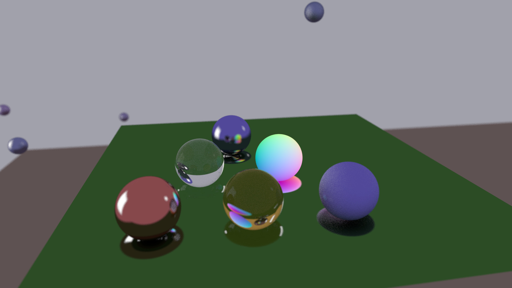
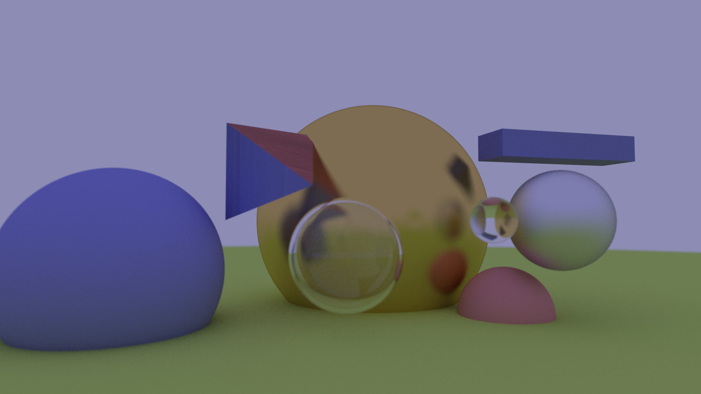

A toy brute force path tracer written in Julia following the tutorial [Ray Tracing in one weekend](https://raytracing.github.io/).

`RayTracer.jl` features two amazing primitives: the `Sphere` and the `Triangle`. Combine these 
primitives with a diffuse, metalic, or dielectric material to make amazing images.




## Usage Example

```julia
height, width = 1080, 1920
samples, max_bounces = 64, 50

red_diffuse_material = RayTracer.DiffuseMaterial([0.7, 0.3, 0.3])
blue_diffuse_material = RayTracer.DiffuseMaterial([0.3, 0.3, 0.8])
dielectric_material = RayTracer.DielectricMaterial(1.5)
blue_metalic_material = RayTracer.MetalMaterial([0.8, 0.8, 0.95], 0.7)
yellow_metalic_material = RayTracer.MetalMaterial([0.8, 0.6, 0.2], 0.2)

scene_objects = [
    RayTracer.Sphere([0.0, -601, -1.0], 600.0, RayTracer.DiffuseMaterial([0.6,0.8,0.2])),

    RayTracer.Sphere([-1.4, -0.5, -3.0], 1, blue_diffuse_material),

    # bubble
    RayTracer.Sphere([0.6, -0.3, -2.0], 0.5, dielectric_material),
    RayTracer.Sphere([0.6, -0.3, -2.0], -0.46, dielectric_material),

    RayTracer.Sphere([1.8, 0.0, -1.6], 0.2, dielectric_material),
    RayTracer.Sphere([1.5, 0.0, -4.0], 1.5, yellow_metalic_material),
    RayTracer.Sphere([2.5, -1.0, -2.5], 0.5, red_diffuse_material),
    RayTracer.Sphere([2.8, 0.0, -2.0], 0.5, blue_metalic_material),

    RayTracer.Triangle(
        RayTracer.Vec([-0.4, 0.0, -3.0]),
        RayTracer.Vec([-0.4, 1.0, -3.0]),
        RayTracer.Vec([0.3, 0.3, -2.0]),
        blue_diffuse_material
    ),

    RayTracer.Triangle(
        RayTracer.Vec([-0.4, 1.0, -3.0]),
        RayTracer.Vec([0.6, 1.0, -3.5]),
        RayTracer.Vec([0.3, 0.3, -2.0]),
        red_diffuse_material
    ),

    RayTracer.Box(
        [2.5, 0.7, -2.5],
        [1.8, 0.0, 0.0],
        [0.0, 0.3, 0.0],
        [0.0, 0.0, -0.5],
        blue_diffuse_material
    )

]

camera = RayTracer.Camera(
    lookfrom=RayTracer.Vec(-0.5, 0.0, 2.0),
    lookat=RayTracer.Vec(1.2, 0.3, -4.0),
    vup=RayTracer.Vec(0.0, 1.0, 0.0),
    vfov=45.0,
    aspect=width/height,
    aperture=1.0/16.0 # Use 0.0 for a perfect pinhole
)

render_properties = RayTracer.RenderProperties(samples, max_bounces)
output_properties = RayTracer.OutputProperties(width, height)

RayTracer.raytrace(output_properties=output_properties, camera=camera, scene=scene_objects, render_properties=render_properties)
```




### Bonus feature: PPM

`RayTracer.jl` can save output images in the highly text based `ppm` format - probably not rendered
as an image anywhere!


